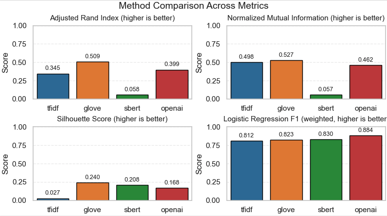

# 🌊 TextWaves: simple NLP analysis on a tiny synthetic dataset

🖊️ [Simon D. Angus](https://research.monash.edu/en/persons/simon-angus), authored with AI-augmentation via SoDa Laboratory's [Assistant AI](assistant.sodalabs.io) tooling.

[SoDa Laboratories](sodalabs.io), Monash Business Schoool, Monash University

Please fork to begin your project -- if using these tools for academic work, please cite as below.

## TL;DR
Lean, hands-on repo to demonstrate three representation “waves” for text-as-data in social science accompanying a series of workshops/talks given at U Greenwhich, LDN, over Sep 1-2 2025 - _Methods in Social Change and Inertia Workshops_:

- Wave 1: TF‑IDF

- Wave 2: Average GloVe embeddings

- Wave 3: Transformer/LLM embeddings (OpenAI or SBERT fallback)

We cluster a small, labelled synthetic corpus (3 classes x ~100 each) and compare separation/quality in 2D. A minimal logistic regression baseline shows how each representation performs on a supervised task. In addition, we compare methods on a realistic scenario, training from each of the different embeddings as if we had access to only the 'historical' data, and predicting on the 'future' data (temporal train/test split).

In addition, we demonstrate synthetic data formation with transformers.

## 🤔Assumptions

You are somewhat comfortable with excuting commands at the terminal, e.g. installing packages from a package manager (e.g. brew, port on Mac OS X). You are willing to work with python, or have used it before. You have some understanding of the techniques being applied here. In other words, you've got some computational interest, and are keen to learn/try-out NLP/AI tooling for computational social science research with text at scale.

## ⚙ Pipeline Approach

The pipeline has five main components:

 1. **Synthesise** -- run once at the start, you can synthesise the tiny data set (default 300 texts, 3 topics) using either a Lexicon or LLM synthesiser (requires OpenAI API key). To support timeseries analysis, as if the texts were produced by real agents over a period of time, the synthetic data is created with a temporal component so that topic intensities ebb and flow over time -- features that we will aim to identify computationally "as if" we trained on a small amount of labelled historical data, and then inferred the perspectives on the topic of future texts.

 2. **Vectorise** -- convert the raw text data into numerical representations (embeddings) suitable for machine learning models. This includes TF-IDF (tfidf), GloVe (glove), and transformer-based embeddings (sbert, openai). In this way, each text is converted to a rich high-dimensional vector which can be consumed by downstream analysis methods.

 3. **Cluster and Visualise** -- apply clustering algorithms (e.g. KMeans) to group similar texts based on their embeddings. This helps to identify patterns and structures within the data. In addition, we apply down-scaling to these vectors to bring their high-dimensional structure to 2-Dimensions using topologically preserving downscaling (UMAP), which helps to visualise the clusters more effectively.

 4. **Train/Predict** -- train logistic classifiers on the vectors "as if" we had only a sample up to a point in time that we labelled, and we then aimed to infer the label of future texts as they arise using our models.

 5. **Compare** -- we calculate metrics for goodness of fit of the clusters to the actual labels, and we also assess the performance of our classifiers on the held-out test set.

 Together, these elements present core features of text-as-data applications for computational social science research and can easily be adapted/extended for different contexts and research questions.


## 🚀Quick start

1) **Install Python 3.10+** (see: https://www.python.org/downloads/)

2) **Install dependencies**

   It is advisable to set up a virtual environment to ensure all packages are contained to this project. To do so run to install, and then activate, the virtual environment:

   ```bash
   python -m venv myvenv
   source myvenv/bin/activate
   ```

   (to deactivate at the end of the session, simply use `deactivate` at the terminal)

   Note: this virtual environment will be valid for your current computer/system only. Set up a new one if you are sharing files across systems and name accordingly (e.g. myvenv -> myvenv-laptop)

   Now, install the required packages:

   ```bash
   pip install -r requirements.txt
   ```

3) (Optional) **Provide an OpenAI key**

   - Copy .env.example to .env and set OPENAI_API_KEY


4) **Generate synthetic data**

   First, we can generate some synthetic data -- using either a lexicon-based approach or a language model (LLM) approach. By default, 300 texts equally split over 3 classes related to perspectives on democracy will be generated, namely: ['deep_democracy', 'mainstream_democracy', 'anti_democratic']. You can see lexicon definitions and LLM prompts to generate these respectively in src/data methods.

   Each will produce a .csv data set in data/ .

   Lexicon dataset (default):

   ```bash
   python -m src.cli.run_pipeline --regen-data --data-source lexicon
   ```

   Example texts:

   ```csv
   text,label_name,timestamp,label
   "No more a practical parliament: Our community won't fight the a transparent parliament. Because the a corrupt families matters, this government will take back the communities!! 🙂",anti_democratic,2024-01-07 00:52:59,2
   I must end to put the people first. 🛡️,anti_democratic,2022-09-22 04:23:56,2
   Who benefits when the economy is ignored? Our community should deliver the process. We plan to deliver local councils.,mainstream_democracy,2024-10-16 11:37:16,1
   No more a free elections: People should deepen the an accountable elections. Who benefits when the a plural media is ignored? Our community will deepen the an accountable courts. No more a deliberative media: People should defend the an open schools.,deep_democracy,2024-04-14 04:58:03,0
   ```

   LLM-authored dataset (requires OPENAI_API_KEY). Note, by default uses `gpt-4.1-nano-2025-04-14` which is a low-cost option. To override this, pass a different OpenAI model via `llm-model`:

   ```bash
   python -m src.cli.run_pipeline --regen-data --data-source llm
   ```

   Example texts:

   ```csv
   text,label_name,timestamp,label
   Borders are just lines created by those in power to divide and conquer us.,anti_democratic,2024-12-19 16:55:14,2
   "Elections are just a show, controlled from behind the scenes by powerful global interests.",anti_democratic,2022-12-27 08:36:39,2
   Strengthening border security while respecting international agreements ensures national stability.,mainstream_democracy,2024-11-27 16:10:28,1
   Transparency in government actions and election procedures fosters confidence and civic engagement.,deep_democracy,2024-04-14 04:58:03,0
   ```
 
5) **Run analysis on generated data** (default lexicon, but use `--data-source llm` to switch to LLM dataset). Note, you must supply a `--method` switch (other switches are optional).

   Vary vectorising method (tfidf, glove, sbert, openai):
   ```bash
   python -m src.cli.run_pipeline --method <method> 
   ```

   For example (tfidf):

   ```bash
   python -m src.cli.run_pipeline --method tfidf
   ```

   If no OpenAI key is found for embeddings (method=openai), the `openai` method automatically falls back to SBERT (`all-MiniLM-L6-v2`). If no key is found for the LLM dataset generator (`--data-source llm`), it falls back to the lexicon generator.

6) **Outputs**

  - outputs/figures/

    - scatter_{method}_{data}.png — 2D plots, color=true label, marker=cluster (data in {lexicon,llm})

    - timeseries_{data}.png — monthly proportions by label (optional flag)

    - timeseries_future_lr_{method}_{data}_cutoff{cutoff}.png - comparison of ground-truth to predicted monthly variation in label proportions

  - outputs/tables/

    - metrics_{method}_{data}.csv — ARI, NMI, Silhouette, LR Accuracy/F1

  - outputs/cache/

    - coords2d_{method}_{data}.npz — cached 2D coordinates per run

  - data/

    - synthetic.csv — lexicon-generated dataset

    - synthetic_llm.csv — LLM-generated dataset

## More Options

To see all available options including control over dimension reduction algorithm, etc., run:

```bash
python -m src.cli.run_pipeline --help
```

You can control each aspect of the pipeline as follows:

```bash
python -m src.cli.run_pipeline --method tfidf --clusterer kmeans --reduce umap --data-source llm
```

## Inference train/test controls

The logisitic models are trained up to a certain fraction of the time-series to mimic training on 'history' and prediction on the 'future. This protects against the situation where the future distribution is exposed to the model potentially over-stating the model performance in a realistic setting.

By default the first 30% of the data (0.3) is used as training data for the model fitting, with the remaining 70% used for testing.

To change the fraction of data used for training versus test, pass e.g. `--train-frac 0.8` (default 0.3).

```bash
python -m src.cli.run_pipeline --method tfidf --train-frac 0.8
```

## Build all three waves to Compare results

```bash
python -m src.cli.build_all
```

Produces a summary table in outputs/tables/summary.csv and all scatter figures (on the default lexicon dataset). You can mix in the LLM dataset by running run_pipeline with `--data-source llm` for each method you want to compare.


### Metrics visualisation

Metrics are produced during the pipeline for clustering goodness of fit, and for the logistic regression model's performance.

After running the `build_all` method, visualise the metrics results with (for lexicon):

```bash
python -m src.viz.results --csv outputs/tables/summary_lexicon.csv
```

For LLM data simply use the file `summary_llm.csv` instead.

Example output:

 
 - Adjusted Rand Index (ARI) and Normalised Mutual Information (NMI) assess the accuracy of the discovered clusters relative to the ground-truth labels, with NMI being a weighted (for abundance) version.
 - Silhouette Score assesses the quality of the clustering by measuring the distance between clusters -- here, since we are using text-based clusters, we use cosine similarity as the distance metric (angular distance).

## Dataset sources (lexicon vs LLM)

- Lexicon generator (default): short texts created from clause-level templates with shared nouns to keep lexical overlap across classes.

- LLM generator: short, social-media-like single-sentence posts authored by an LLM. Defaults to `gpt-4.1-nano-2025-04-14`; override with `--llm-model`. If `OPENAI_API_KEY` is missing, the LLM generator automatically falls back to the lexicon generator.

Classes are the same in both datasets: `deep_democracy`, `mainstream_democracy`, `anti_democratic`.

Example regeneration only (no pipeline run):

- Lexicon:  python -m src.cli.run_pipeline --regen-data --data-source lexicon

- LLM:      python -m src.cli.run_pipeline --regen-data --data-source llm

## What this repo shows

- How representation choices affect cluster structure and downstream performance (TF‑IDF → GloVe → LLM embeddings).

- How different dataset sources (lexicon vs LLM-authored) influence separability and performance while keeping labels identical.

- Simple, modular code that you can reuse in your own projects (data generation, vectorization, clustering, reduction, metrics, visualization).

- Graceful key handling via .env and caching to avoid repeated API calls.

## Things to Extend/Try

There are many ways that this repo could be applied/extended or adapted. Here are just a few ideas:

 - Experiment with different vectorization methods or parameters to see how they affect clustering and classification performance.
 - Try using different clustering algorithms (e.g., DBSCAN, hierarchical clustering) and compare their effectiveness.
 - Implement additional dimensionality reduction techniques (e.g., t-SNE, PCA) and evaluate their impact on visualization and clustering.
 - Explore the use of different LLM models for data generation and see how they influence the results.
 - Integrate with other NLP libraries or frameworks to enhance functionality (e.g., Hugging Face Transformers).
 - Use provided switches to add noise to the synthesised dataset -- how robust are the methods now?

## Configuration

Basic knobs live in configs/config.yaml. Reasonable defaults are applied if the file is missing.

- Vectorizers: set TF‑IDF params; choose GloVe model; choose OpenAI embedding model and batch_size; choose SBERT fallback model.

- Data: adjust counts, time span, and optional label noise in `data`.

- Reduce/Cluster: you can set `reduce.method` and `cluster.algorithm` in YAML; the CLI flags `--reduce/--clusterer` override these if provided.

- PCA uses `reduce.n_components` now (same field used by UMAP).

- For the LLM dataset generator, choose the model at runtime via `--llm-model` (e.g., `gpt-4.1-nano-2025-04-14`).

Notes:

- GloVe is loaded via `gensim.downloader` (glove-wiki-gigaword-50). Internet is required on first run.

- SBERT fallback model (`all-MiniLM-L6-v2`) is downloaded on first use.

- The LLM generator uses OpenAI chat completions to author short posts; content filters avoid unsafe outputs and the system falls back if the API key is unavailable.

- For teaching, we keep algorithms to simple defaults (KMeans, UMAP/PCA). You can toggle to PCA with `--reduce pca` if UMAP is not preferred.

## License

MIT.

## To cite

If you fork/apply this repository for your research, please cite as:

Bibtex:

```latex
@misc{angus2025textwaves,
  author = {Angus, SD},
  title = {TextWaves: simple NLP analysis on a tiny synthetic dataset},
  year = {2025},
  url = {https://github.com/sodalabsio/textwaves},
  note = {GitHub repository}
}
```

APA:

```text
Angus, S. (2025). TextWaves: simple NLP analysis on a tiny synthetic dataset [Computer software]. GitHub. https://github.com/sodalabsio/textwaves
```

